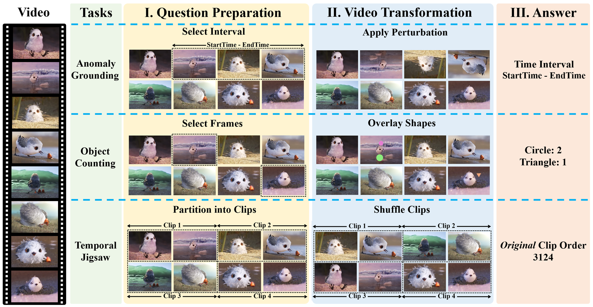
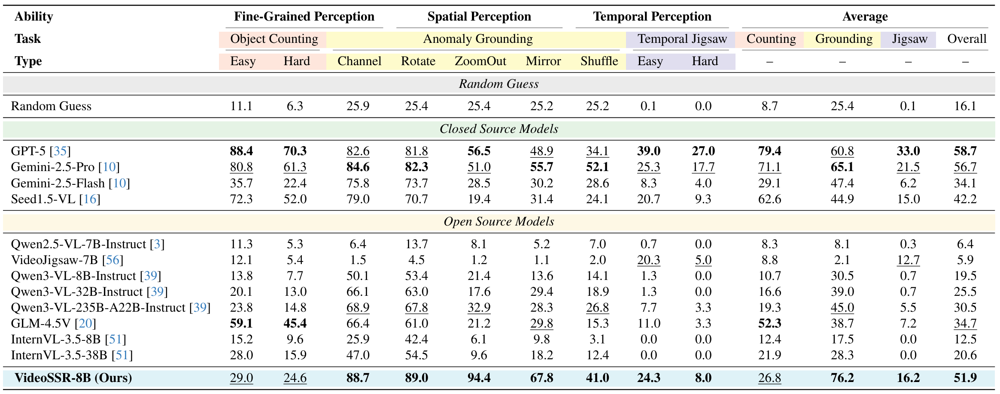

# VideoSSR: Video Self-Supervised Reinforcement Learning


[](<https://arxiv.org/abs/2511.06281>)
[](<https://huggingface.co/yhx12/VideoSSR>)
[](<https://huggingface.co/datasets/yhx12/VideoSSR-30k>)
[](<https://huggingface.co/datasets/yhx12/VIUBench>)

This repository contains the official implementation for the paper "VideoSSR: Video Self-Supervised Reinforcement Learning".

VideoSSR is a novel framework designed to enhance the video understanding capabilities of Multimodal Large Language Models (MLLMs). Instead of relying on prohibitively expensive manually annotated data or biased model-annotated data, VideoSSR harnesses the rich, intrinsic information within videos to generate high-quality, verifiable training data. We introduce three self-supervised pretext tasks: Anomaly Grounding, Object Counting, and Temporal Jigsaw. Building upon these tasks, we construct the VideoSSR-30K dataset and train models with Reinforcement Learning with Verifiable Rewards (RLVR), establishing a potent foundational framework for developing more advanced video understanding in MLLMs.
## Pretext Tasks


## VIUBench
To rigorously test the capabilities of modern MLLMs on fundamental video understanding, we introduce the **V**ideo **I**ntrinsic **U**nderstanding **Bench**mark (**VIUBench**). This benchmark is systematically constructed from our three self-supervised pretext tasks: Anomaly Grounding, Object Counting, and Temporal Jigsaw. It specifically evaluates a model's ability to reason about intrinsic video properties—such as temporal coherence and fine-grained details—independent of external annotations. Our results show that VIUBench poses a significant challenge even for the most advanced models, highlighting a critical area for improvement and validating the effectiveness of our approach.

## Performance Highlights


## Installation

We recommend directly using the latest version of **[verl](https://github.com/volcengine/verl)** and following its instructions to configure the environment.

The key configurations of the environment we used are as follows:
```
vllm==0.11.0
transformers==4.57.0.dev0
torch==2.8.0
torchcodec==0.7.0+cu128
```
## Training

First, download the VideoSSR-30K dataset or build your own training data.

Then, run the training script:
```bash
bash ./train/train.sh
```

**Update:** For better compatibility with Qwen3-VL, we recommend using the latest version of **[verl](https://github.com/volcengine/verl)**. If you do this, you only need to copy the reward function from `./verl/verl/utils/reward_score` to the corresponding location.

## Evaluation
### Video QA
```bash
python ./eval/vqa.py 
```

### Temporal Grounding

```bash
python ./eval/vtg.py 
```

### Data Format

To facilitate standardized testing, we organize the data for all evaluation tasks into the following JSON format. 

```json
{
    "video": "fFjv93ACGo8",
    "question": "...",
    "answer": "C"
}
```


## Prepare Your Own Data

We provide the necessary scripts in the `./pretext_tasks` directory for you to create your own datasets using our self-supervised methods.

The process involves two main stages:

1.  **Frame Sampling**

    First, prepare your source videos. Then, use the `sample_frames.py` script to preprocess them and extract frames. This step prepares the visual data in a format required by the task generation scripts.

    ```bash
    # Example usage:
    python ./pretext_tasks/sample_frames.py 
    ```

2.  **Generating Pretext Task Data**

    Once your frames are sampled, you can use the following scripts to generate training data for each of our self-supervised pretext tasks:

    *   `grounding.py`: To create data for the Anomaly Grounding task.
    *   `counting.py`: To create data for the Object Counting task.
    *   `jigsaw.py`: To create data for the Temporal Jigsaw task.

    ```bash
    python ./pretext_tasks/grounding.py
    python ./pretext_tasks/counting.py
    python ./pretext_tasks/jigsaw.py
    ```


## Acknowledgement


This work was developed upon **[verl](https://github.com/volcengine/verl)**. We also thank the great work of **[Visual Jigsaw](https://github.com/penghao-wu/visual_jigsaw)** for the inspiration.
